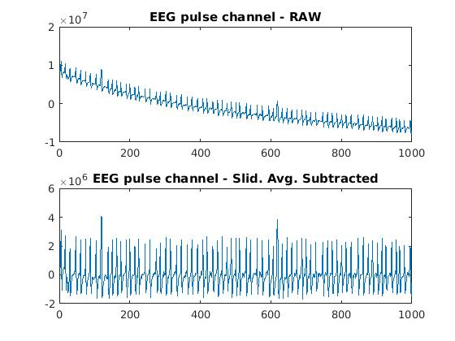

# zeeg
Matlab scripts synchronizing data from Enobio EEG device with SMR data from electrophys rig. 

There are two scripts intended for regular use. 

The 'esSync' script looks at an entire set of EEG data and its corresponding SMR export file, and computes an offset and scale factor to transform the EEG data into the time coords of the 1401 data. The result is a single mat file that is used later when EEG data is to be fetched. 

The 'getEEGData' script uses the output from 'esSync' and fetches EEG data from specific time blocks. The time periods are specified in SMR time, and the script converts the SMR time to EEG time, and returns the data. A vector with corresponding time values (converted to SMR time) is also returned. 

**Background**

The 1401 and the Enobio each operate with their own clocks. Since the 1401 is central to our experiments, and all behavior and stimulus-related events are recorded there, analysis will call for data from time periods defined in SMR time units. 

During DAQ, the 1401 generates a stream of TTL pulses 1s apart. At the start of DAQ, there is a burst of 3 pulses much closer together - these are intended to identify an anchor point connecting the SMR and the EEG data streams. Once we can connect a specific pulse in each data stream, we can associate all the pulses by simply counting out from the *base pulse*. 

The data are stored in a single folder. That folder will contain a set of EEG data files with extension *\*.easy*, and a *mat* file exported from the SMR data file.

**Algorithm**

I assume that the clocks are _close_ to synchronized, and that if they're off, any drift in one of the clocks is linear over time. The eeg data is sampled at 500Hz, and each sample is timestamped with an integer clock value (ms).

A single DAQ session with the EEG device yields a series of *\*.easy* files, each corresponding to the series of acquisition and stimulation periods used in the NIC configuration. The files follow a naming scheme that looks like this:

```
<timestamp>_<EEGDatasetName>_Baseline_EEG_Trial_1.easy
<timestamp>_<EEGDatasetName>_Stim_Trial_1.easy
... 2, 3, ...
<timestamp>_<EEGDatasetName>_EEG_Trial_n.easy
<timestamp>_<EEGDatasetName>_Stim_Trial_n.easy
...
<timestamp>_<EEGDatasetName>_Baseline_EEG_End.easy
```
The *"Stim"* files above are recorded during stimulation, and during that period the pulses are not recorded (mystery to us, as the pulses are continuous throughout, but the Enobio doesn't register the pulses in these files). So, we're only interested in the "Baseline" files and each of the "EEG_Trial" files. These files can be imported with ```importdata```. There are 13 columns in the data, and each row is a sample. Columns 1-8 correspond to EEG channels 1-8. Column 13 is the timestamp from the NIC device. 

Below is the pulse channel of an EEG data file (top plot), and the same data with a sliding-window average subtracted. 



The pulses are visible to the eye, but they are not clean and rectangular. To locate the position of the pulses, move a horizontal threshold lower via steps, starting at the peak Y value in the file. At each step, I find all data points above the threshold. Then I form simple clusters by assigning values form adjacent measurements to the same cluster. For all clusters found, I test that they are all spaced by approximately 1s. When there are any clusters that do not satisfy this criteria, the "steps" stop, and I use whatever clusters have been found by that point. 

This process is repeated for each file. 

Next, we use each pulse position and its (known) place in the sequence of pulses to compute a value of K, the scale factor:

```
t(SMR)-t(SMR,base) = K * [ t(eeg)-t(eeg,base) ]
```
Here, the 'base' values are the times corresponding the the user-identified 'base pulse'. 


The data stream has a regular series of TTL pulses that are simultaneously recorded by the 1401 and by the Enobio. Thus, we have many data points to use for computing the scale factor K. The offset is determined using input given by the user. The series of pulses that are recorded start with a sequence of 3 pulses close together, and are followed by pulses separated by about a second. The PLAN was that those three pulses would serve as an anchor - allowing for a clear identification of the same time point in both files - and hence determining the offset between the files. Unfortunately, the EEG data files in practice are too noisy for a clean, consistent identification of the pulse group. Instead, a user is asked to identify a single pulse in the train and specify *which pulse it is* in the sequence. (The easiest thing is to identify the first or second pulse in the train -- its important that the EXACT position in the train is known). 

I apply a quick-and-dirty algorithm to locate pulses in the EEG data. 


Note that it is not critical that ALL pulses be identified. To a good first approximation the scale factor between the clocks is 1 (actually, its 0.001, because the SMR data in the mat file exported are converted to seconds, whereas the Enobio EEG data is marked with a time coordinate in milliseconds. Consequently, the position of the pulses in the sequence recorded in the EEG file can be identified with high confidence. Once a pulse is identified as a particular pulse, for example, the 10th pulse. The time value of the 10th pulse in the SMR data is known, and the value of K can be computed for that pulse. This computation is repeated for each pulse that is identified in the EEG file. 


Enobio EEG device dumps data to a folder with *.easy* files. 
File naming follows pattern of Stim-Trial-Stim-Trial.......
We only look at _Trial_ files (no electrode recording during stimulation)

The signals/pulses can be crappy. Don't sweat too hard, instead rely on consistency internally. 
Load voltage stream for pulse channel, this channel _should_ have the TTL pulses generated by the script.

Get sliding average and subtract it off. Take max/min of remaining signal, split into steps. 
Step down from top to bottom, at each step find points above threshold. Clusters assumed to be adjacent
indices. Check distance between clusters, quit when clusters closer together than a min distance. 

Need more data to test with. 

To run, 

>> blob=esSync('./../data', 'Dr. Zaius_eeg_000_20180126.mat');
>> [allIndices, allK] = esSyncTest(blob);

That should generate a plot of k - conversion factor between files.
